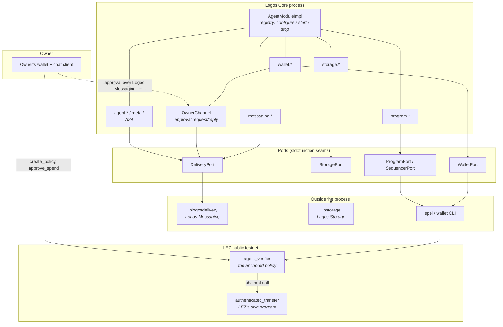
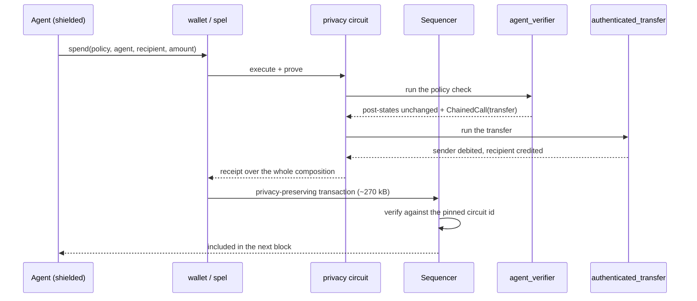
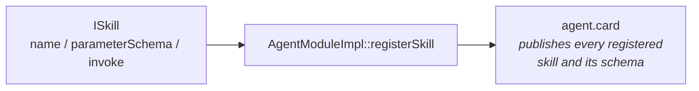
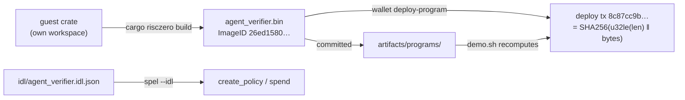

# Architecture

How the pieces fit, and — more usefully — why the seams are where they are.

The whole design follows from one constraint: **the agent runs on a machine its
owner does not control.** Anything it decides for itself, whoever takes the
process decides differently. So every decision that matters is pushed either
onto the chain, where the agent cannot rewrite it, or behind a port, where it
can be tested against a hostile fake. What is left in the middle is plumbing.

## The map



Read it as three tiers. The chain is the only tier with authority. The ports are
the only tier that touches the outside world. Everything between them is C++ that
can be exercised with no node, no network and no key — which is why CI can check
it honestly.

| Tier | Path | Language | Runs where |
|---|---|---|---|
| Spending policy, on chain | `crates/agent-verifier-spel/methods/guest/` | Rust → RISC-V guest | inside the zkVM, on the sequencer or in the privacy circuit |
| Policy derivations | `crates/agent-policy-core/` | Rust, `no_std`-capable | both in the guest and on the host |
| Agent module | `module/src/` | C++17 | in the Logos Core process |
| Node drivers | `module/tests/*_drive.c` | C | against a real Delivery / Storage node |
| Operations | `scripts/` | bash | the operator's machine |

## The chain tier

`agent_verifier` is a SPEL program with four instructions. Three of them exist
to make the fourth trustworthy.

| Instruction | Signed by | Accounts | What it is for |
|---|---|---|---|
| `create_policy` | owner | policy (init, PDA), owner | anchor an envelope by address |
| `approve_spend` | owner | approval (init, PDA), policy (PDA), owner | authorise one exact payment |
| `spend` | agent | policy (mut, PDA), agent, recipient | pay inside the envelope, unattended |
| `spend_approved` | agent | policy (PDA), approval (mut, PDA), agent, recipient | pay outside it, on that approval |

Two structural decisions are worth pulling out.

**The limits are an address; the running total is data.** `compute_policy_hash`
folds (owner, agent, per-tx, per-period, period) into a digest
(`crates/agent-policy-core/src/lib.rs:77-86`) and the policy account is the PDA
seeded by it, so a limit cannot be edited — a different limit is a different
account. The account's *data* is the one thing that does change: a 24-byte
ledger, `window_start` then `spent`, written by `spend` and by nothing else,
because the account is this program's PDA and LEZ rule 6 refuses a data write
from any other program. Earlier revisions of this file said nothing was written
there at all, which made the per-period ceiling unenforceable and was wrong.
What that buys, and what it still does not, is
[`security-model.md`](security-model.md).

**The program moves no money itself, and cannot.** LEZ rule 5 refuses any
post-state that decreases the balance of an account the executing program does
not own (`lee/state_machine/core/src/program/mod.rs:707-716`), and an agent's
account is owned by LEZ's `authenticated_transfer`. So `spend` checks the
envelope and then returns a `ChainedCall` into whichever program already owns the
agent's balance — `agent.account.program_owner`, read off the account rather than
carried as a constant, so no argument and no deployment constant can redirect a
payment (`agent_verifier.rs:663-691`). LEZ's own `vault` program does the same
thing (`lez/programs/vault/src/main.rs:47-58`).



The chained call is not a hint the sequencer takes on trust: the circuit
re-executes the callee and checks it under `env::verify`
(`lee/privacy_preserving_circuit/src/execution_state.rs:149-155`). On the public
path the state machine re-executes instead of verifying
(`lee/state_machine/src/program/mod.rs:73-77`). Both enforce the same program;
only one of them hides who paid.

That is why `artifacts/programs/authenticated_transfer.bin` is committed
alongside our own program. We do not deploy it — the chain already runs it — but
the circuit needs the callee's ELF to compose the inner call, and without it the
build stops at `UndeclaredProgramDependency`. `scripts/demo.sh` pins the file by
content hash and reads its ProgramId back off the chain rather than asserting it.

## One derivation, two consumers

`crates/agent-policy-core` is small and it is load-bearing. It holds the three
derivations — policy hash, spend reference, approval marker — each under its own
domain separator, so a digest computed for one role can never be valid in
another (`lib.rs:69-71`, and the test that asserts the three prefixes differ at
`:541-542`).

It also holds the spend decision itself. That used to be a pure comparison
called `is_autonomous`; it is now `SpendPolicy::authorize`
(`lib.rs:156-191`), which takes the ledger read out of the policy account and
the period the caller declared, and returns either the ledger to write back or
one of five typed refusals (`SpendRefusal`) that the guest maps to stable error
codes. The decision moved here, rather than staying in the guest, so that the
per-period arithmetic — window alignment, regression, saturating addition near
`u128::MAX` — is covered by ordinary host unit tests instead of only by
executing a zkVM binary.

The point is that it is compiled **twice**: into the guest, where the chain
checks the derivation, and into the host, where the crate's examples are invoked
by the deploy and settlement scripts — `policy-hash` for the anchor
(`scripts/deploy-agents.sh:276`, `scripts/e2e-local-sequencer.sh:222`),
`spend-marker` for an approval (`scripts/a2a-task.sh:217`), and `window-start`
for the period a spend declares (`scripts/a2a-task.sh:234`,
`scripts/e2e-local-sequencer.sh:277`). The address a script computes is
therefore the address the program derives, and the period it names is computed
by the same `window_start_for` the guest checks — by construction rather than by
agreement. A divergence would be a compile error, not a transaction that fails
on chain for reasons nobody can see.

The workspace split exists for the same reason it does in LP-0002 and LP-0003:
the guest targets `riscv32im-risc0-zkvm-elf` and carries its own `[workspace]`,
so `cargo build --workspace` on the host never tries to build it. The policy
crate reaches both sides by path: a workspace member on the host, a path
dependency of the guest.

## The module tier

`AgentModuleImpl` (`module/src/agent_module_plugin.h`) is a registry, not a god
object. Its whole contract is `configure` once with the anchored policy address,
`start` before any skill call, `stop` before shutdown
(`agent_module_plugin.h:17-19`), plus `registerSkill` and `skills()`.

A skill is anything implementing `ISkill` — a name, a JSON Schema for its
parameters, and an `invoke` (`module/src/agent_module_interface.h:51-79`). That
is the extension point the prize asks for: a third party adds a skill by
implementing three methods and calling `registerSkill`, and the plugin is not
edited. `registerSkill` refuses a duplicate name rather than overwriting, so one
plugin cannot shadow another's `wallet.send`.



The Agent Card is generated from the registry rather than hand-written, so a
skill that is registered is advertised and one that is not, is not.

### The port pattern

No skill links a library. Each takes a struct of `std::function`s and calls
through it:

| Port | Header | Members |
|---|---|---|
| `DeliveryPort` | `messaging_skills.h:28` | `ready`, `send(topic, payload)`, `subscribe`, `channelCreate` |
| `StoragePort` | `storage_skills.h:22` | `ready`, `upload`, `download`, `manifests`, `exists` |
| `SharePort` | `storage_skills.h:37` | `send(recipient, message)` |
| `WalletPort` | `wallet_skills.h:102` | `getAccount`, `walletAccount`, `getTransaction`, `journal`, `spend`, `spentThisPeriod` |
| `ProgramPort` | `program_skills.h:66` | `call`, `deploy`, `read` |
| `SequencerPort` | `program_skills.h:80` | `rpc(method, params)` |
| `OwnerChannelPort` | `owner_channel.h:193` | `ready`, `channelCreate`, `channelSend`, `drain`, `nowMs`, `idle` |
| `CardPort` / `DiscoveryPort` / `TaskPort` / `StatusPort` / `ConfigPort` | `agent_skills.h:186`, `:218`, `:227`, `:244`, `:261` | the A2A seams |
| `HttpTransport` | `inference.h:229` | `post` |

This is not indirection for its own sake. It is what lets CI assert the
behaviour that actually matters — that a skill refuses when the node is down,
that it blames the right half of a failed share, that an owner who never answers
is terminal rather than a quiet fallback — with no node, no network and no
model. A real dependency cannot be made to fail on demand; a fake can.

### The skill catalogue

| Category | Skills | Port |
|---|---|---|
| Storage | `storage.upload`, `storage.download`, `storage.list`, `storage.share` | `StoragePort` (+ `SharePort`) |
| Messaging | `messaging.send`, `messaging.join`, `messaging.create_group` | `DeliveryPort` |
| Blockchain | `wallet.balance`, `wallet.send`, `wallet.history` | `WalletPort` (+ owner channel) |
| Blockchain | `program.query`, `program.call`, `program.deploy` | `ProgramPort`, `SequencerPort` |
| Agent / A2A | `agent.card`, `agent.discover`, `agent.task`, `agent.subscribe`, `agent.cancel` | `CardPort`, `DiscoveryPort`, `TaskPort` |
| Meta | `meta.status`, `meta.configure` | `StatusPort`, `ConfigPort` |
| Optional | `agent.evaluate_task` | `HttpTransport` |

`storage.share` deserves a note, because its shape is forced by the protocol
rather than chosen: content addressing means there is nothing to copy and no
permission to grant, so sharing is *sending someone an address*, which is a
messaging act. It therefore takes both ports and reports which half failed.

What each of these is actually wired to, and what is only compiled, is tracked in
[`skills.md`](skills.md) — that document is the honest status, this one is the
shape.

### The owner channel

An above-threshold spend is the one case where the agent has to stop and ask.
`OwnerChannel` (`module/src/owner_channel.{h,cpp}`) opens a **reliable channel**
— not a bare topic, because a dropped approval request looks exactly like a
refusal — on `/lp-0008/1/owner-channel/<owner>/<agent>`, sends a
`spend_approval_request` naming the policy, recipient, amount, nonce and marker
seed, re-sends every 15 s, and after 120 s with no answer returns
`ApprovalVerdict::Unreachable`, which is terminal
(`owner_channel.h:233`, `owner_channel.cpp:456`). It never falls back to acting
alone; the prize is explicit that an above-threshold transaction which cannot
reach its owner must not execute.

A reply is only an answer if it agrees on every field of the request, and a reply
carrying `per_tx`, `per_period`, `period_blocks` or `policy` is refused outright
— "an approval names a payment, it cannot change a limit"
(`owner_channel.cpp:155-158`).

## Where the A2A layer sits

A2A is deliberately transport-agnostic and deliberately silent about payment.
Both gaps are filled here, and nowhere else in the stack:

- **Transport**: Logos Messaging replaces A2A's HTTP. Agent Cards carry
  `"preferredTransport": "logos-messaging"` and a `logos-messaging://<account>`
  URL (`module/src/agent_skills.cpp:634-641`); requests are A2A JSON-RPC
  (`message/send`, `tasks/cancel`) carried as message payloads on a content
  topic derived from the agent and the task (`taskTopic`,
  `agent_skills.cpp:193-196`).
- **Payment**: an `x-logos` extension block on the card carries the LEZ account,
  the public payment account, the price per task, and
  `"settlement": "lez-chained-authenticated-transfer"`
  (`agent_skills.cpp:711-721`).

The task lifecycle is A2A's — `submitted`, `working`, `input-required`,
`auth-required`, `completed`, `canceled`, `failed`, `rejected`
(`agent_skills.h:51-61`) — with the legal transitions enforced in one place
(`canTransition`) and state kept in a `TaskStore` that can be snapshotted and
restored so a node restart does not lose an open task.

```mermaid
sequenceDiagram
    participant C as Client agent
    participant T as Logos Messaging
    participant Sv as Server agent
    participant L as LEZ

    Sv->>T: publish signed Agent Card (discovery topic)
    C->>T: agent.discover → fetch + validate cards
    Note over C: reject unsigned or malformed cards
    C->>C: price ≤ max_price? inside the anchored envelope?
    C->>T: agent.task → A2A message/send (submitted)
    Sv-->>T: status updates (working → completed)
    C->>L: spend, signed by the client agent itself
    L-->>C: settlement included; recipient's balance moves
```

The ordering is not incidental: the request is posted first and paid second, and
a payment with no transaction hash is never recorded as a payment. The same rule
governs the shell driver — `scripts/a2a-task.sh` refuses to write its manifest
unless the settlement confirmed *and* the recipient's balance moved by exactly
the price, because an earlier version of this instruction produced confirmed,
on-chain proofs that a policy permitted 25 LEZ and moved nothing at all.

`scripts/a2a-task.sh` and the in-module skills are two views of the same flow.
The script is the end-to-end evidence path — it runs against the public testnet
and leaves a manifest in `artifacts/` — while the module is the same lifecycle
inside the Logos Core process. They agree on the wire format (the card, the
topics, the `x-logos` block) because that is the part the chain and the network
see.

## The Delivery and Storage drivers

Both libraries are C ABIs over Nim, built from source with no privileged step,
and neither is vendored into this repository. `scripts/exercise-nodes.sh` builds
`module/tests/delivery_node_drive.c` and `module/tests/storage_node_drive.c`
against `liblogosdelivery` and `libstorage` and runs them against live networks,
with every step an assertion and the exit code as the result.

Two things about that build are worth knowing before trying it: `make` installs
`nimble` outside `PATH`, which is the whole reason the documented command
exports it; and `librln` is a **downloaded release asset** for the host triple,
not a cargo build — an earlier version of `skills.md` claimed the cargo path as
fact and was wrong. The driver runs are local rather than CI, because building
the libraries takes tens of minutes and the runs need live peers, and a job that
depends on someone else's uptime teaches everyone to ignore it.

The ports above are the seam that keeps this honest: the skills are written
against the real signatures, and "compiles against the real ABI" is stated as
exactly that in [`skills.md`](skills.md), never as "works".

## Build and deployment topology



A LEZ deploy transaction hash is the content address of the bytecode, so the
committed binary hashes to exactly its own deployment — which is what lets
`scripts/demo.sh` prove, from a clean clone with no keys and no funded account,
that the program on chain is the program in this repository. Deployment is
idempotent for the same reason.

`vendor/spel` is a pinned copy of the SPEL framework repinned to LEZ v0.2.4
(`47eba25`); the published spel releases lag the testnet, so the framework types
are aligned to `lee_core` there rather than taken from crates.io. The
instruction ABI the CLI drives comes from `idl/agent_verifier.idl.json`, which
the `#[lez_program]` macro generates from the same source the guest is built
from.

Two CI workflows, split by what they can honestly assert:

- `.github/workflows/ci.yml` — minutes, gates every push: the policy crate and
  its adversarial tests, the committed binary still hashing to the deployed
  transaction *and* that transaction being live on the public testnet with a
  cannot-exist hash as the control, `demo.sh` from a clean clone, and each C++
  suite against fake ports as its own step so a red X names the suite.
- `.github/workflows/e2e-local-sequencer.yml` — an hour or more, scheduled: the
  whole policy lifecycle against a real standalone LEZ sequencer with
  `RISC0_DEV_MODE=0`. It has no skip path, deliberately: a competing submission
  was closed because its e2e job "completed through its explicit skip path".

## Reading order

- [`security-model.md`](security-model.md) — what the agent may do alone, and
  what an attacker who holds its keys gets.
- [`benchmarks/cu-budget.md`](benchmarks/cu-budget.md) — what every on-chain
  operation costs, measured.
- [`DEPLOYMENT.md`](DEPLOYMENT.md) — what is live, and how to re-verify it.
- [`limitations.md`](limitations.md) — what does not work, and what was
  retracted.
- [`skills.md`](skills.md) — which skills are wired to a running node and which
  are only compiled.
